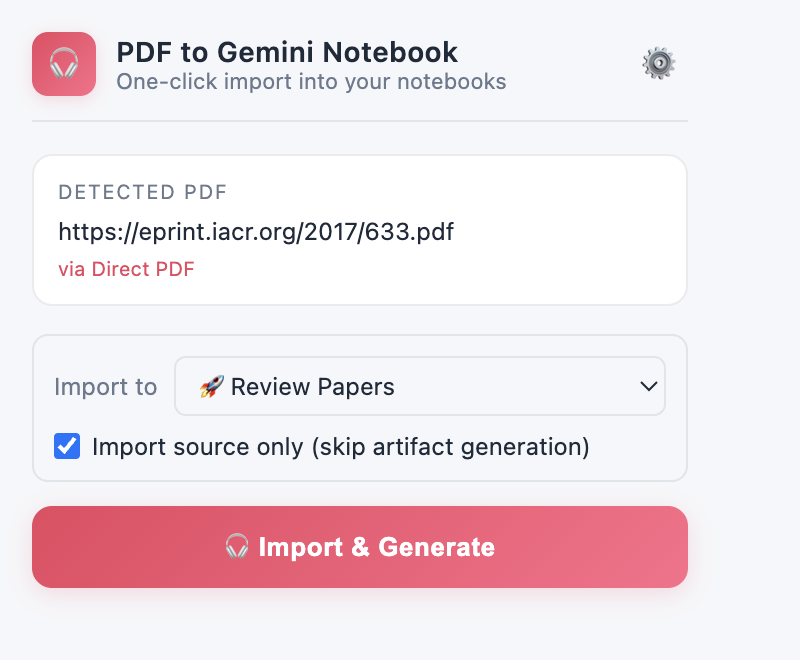
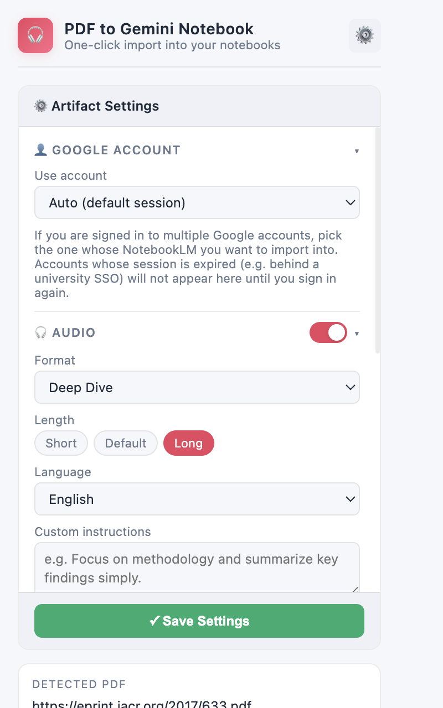

# Chrome PDF to NotebookLM

**English** | [简体中文](./README.zh-CN.md)

Turn a PDF, arXiv page, or webpage into a NotebookLM notebook and generate artifacts (audio overview, infographic, and more) in one click.

## Screenshots

## Key Features

- **Smart PDF detection** — direct PDF URLs, arXiv abstract/HTML/PDF pages, and PDF links on regular pages
- **One-click pipeline** — creates a notebook, adds the source, and starts artifact generation in a single flow
- **Background progress** — the pipeline keeps running even after you close the popup; a desktop notification and chime fire on completion (both on by default, toggleable in settings)
- **Local PDF upload** — reads the PDF in the current tab directly, or falls back to a file picker
- **Rich artifact settings** — toggle and configure Audio Overview, Video, Report, Quiz, Flashcards, Infographic, Slide Deck, Mind Map, and Data Table from the gear panel

## Install

### Option A: From a release (recommended)

1. Download the latest `chrome-pdf-to-notebooklm-vX.Y.Z.zip` from the [Releases page](https://github.com/Drscq/chrome-pdf-to-notebooklm/releases/latest) and unzip it.
2. Open `chrome://extensions` in Chrome.
3. Enable **Developer mode** (top-right corner).
4. Click **Load unpacked** and select the unzipped folder (the one containing `manifest.json`).
5. Confirm **Chrome PDF to NotebookLM** appears in your extension list.

> Note: Chrome does not allow installing zip/crx files directly from outside the Chrome Web Store, so unzipping and loading the folder is the intended install path. Keep the folder in place after installing — Chrome loads the extension from it on every startup.

### Option B: From source

1. Clone or download this repository.
2. Follow steps 2–5 above, selecting the repository root folder.

## How to Use

1. Sign in to NotebookLM at `https://notebooklm.google.com` with your Google account.
2. Open a PDF, arXiv page, or any webpage, then click the extension icon.
3. Click the action button that matches your situation:
   - **🎧 Generate Artifacts** — a PDF was detected on the page
   - **Use Current Webpage URL** — no PDF detected; import the page itself as a source
   - **Use Current PDF and Generate** — the current tab is a local PDF file
   - **Upload Local PDF** — pick a PDF from your computer manually
4. (Optional) Click the gear icon to choose which artifacts to generate and fine-tune their settings.
5. Track progress in the popup, then open the result via **Open Notebook in NotebookLM**.

## Permissions & Privacy

- The extension talks only to `notebooklm.google.com` (using your existing Google session) and to the site hosting the PDF you import. There are no third-party servers, no analytics, and no tracking.
- Broad host access (`*://*/*`) is required for the fallback that downloads a PDF directly and re-uploads it when NotebookLM refuses a URL import.
- To read local `file://` PDFs from the current tab, enable **Allow access to file URLs** in the extension's details page.
- Anything you import — including paywalled or private PDFs your browser session can access — is uploaded to your own Google NotebookLM account. Keep that in mind for sensitive documents.
- This extension uses NotebookLM's private web API, so behavior may break when Google changes NotebookLM.

## Troubleshooting

- **Nothing happens after clicking a button** — make sure you are signed in to NotebookLM first.
- **Local PDF read fails** — enable **Allow access to file URLs**, reload the extension, and retry.
- **URL import fails** — the source site may block automated downloads; download the PDF manually and use **Upload Local PDF** instead.

## Credits

- Forked from [`mahlernim/chrome-pdf-to-notebooklm`](https://github.com/mahlernim/chrome-pdf-to-notebooklm).
- NotebookLM protocol implementation was heavily informed by [`teng-lin/notebooklm-py`](https://github.com/teng-lin/notebooklm-py).

## License

MIT. See [LICENSE](./LICENSE).
